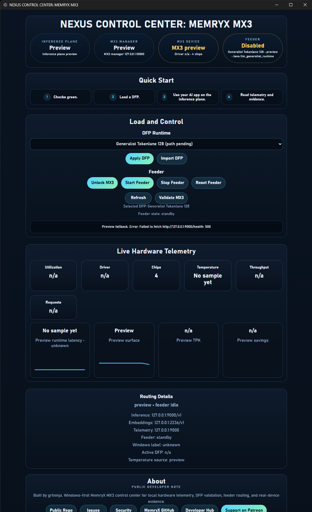

# NEXUS CONTROL CENTER: MemryX MX3

`NEXUS CONTROL CENTER` is a small app for proving LLM inference on MX3 hardware.



Use it to validate the MX3 path, load DFP runtimes, control feeder state, and read live hardware telemetry.

## Hardware requirement

This app requires a MemryX AI Accelerator.

Without supported MemryX hardware, the MX3 device path, DFP runtime controls, feeder controls, and live hardware telemetry will not become active.

## What it does

1. Checks the MX3 path and manager boundary.
2. Loads and switches DFP runtime targets.
3. Starts, stops, unlocks, and resets feeder state.
4. Shows live telemetry, latency, TPK, thermals, and savings estimates.
5. Keeps LM model loading in LM Studio or your preferred inference app.

## How this helps MemPalace

This app does not try to replace MemPalace.

It helps MemPalace at the exact seams that matter most for local retrieval:

1. faster local embeddings for Chroma ingest and query
2. an optional local rerank step after retrieval
3. visible hardware proof, latency, TPK, and savings evidence instead of vague acceleration claims

That makes it easier to keep MemPalace's memory structure and workflow intact while improving the expensive parts around vector search.

## What TPK means

`TPK` means `tokens per kilowatt-hour`.

In simple terms, it answers one question: how much text did the system produce for the electricity it used?

Why it matters here:

- this repo is meant to prove real local MX3-backed inference, not just that a UI loaded
- TPK gives you a simple efficiency number you can compare across runs
- it helps show whether feeder state, DFP selection, and hardware routing are producing better real-device results

If TPK shows `n/a` or `Preview`, the app has not captured enough verified local evidence yet.

## Quick start

### For humans

1. Checks green.
2. Load a DFP.
3. Use your AI app on the inference plane.
4. Read telemetry and evidence.

More detail:
- `docs/HUMAN_QUICKSTART.md`
- `docs/UI_VALUE_NOTES.md`

### For AI agents

Use the agent contract here:
- `docs/AGENT_QUICKSTART.md`
- `docs/PUBLIC_BOUNDARIES.md`
- `docs/PUBLIC_FILE_MAP.md`

## Runtime

- `http://127.0.0.1:9000/v1` is the aggregate inference plane.
- `http://127.0.0.1:10000` is the MX3 manager and device boundary.
- `http://127.0.0.1:2236/v1` is the embedding lane.
- `http://127.0.0.1:2337/v1` is the hosted chat lane.

LM model loading belongs to LM Studio, not this app.

The desktop app is frontend-only. It should be used as a control and telemetry surface over an already-running backend.

## Python quick start

```bash
pip install -e ".[dev]"
python -m mx3_public_shim.doctor
python -m mx3_public_shim.server
```

## Desktop quick start

```bash
npm install
npm run desktop:start
```

## Official links

- Public repo: `https://github.com/grtninja/mx3-public-shim`
- MemryX GitHub: `https://github.com/memryx`
- MemryX Developer Hub: `https://developer.memryx.com/`
- MemryX site: `https://memryx.com/`
- MemPalace correlation: `docs/MEMPALACE_CORRELATION.md`
- MemPalace example: `contrib/mempalace/examples/mx3_shim_chroma_accel.md`

## Support development

- Patreon: `https://www.patreon.com/cw/grtninja`
- Posts: `https://www.patreon.com/grtninja/posts`

## Validation

```bash
pytest -q
ruff check .
ruff format --check .
```
