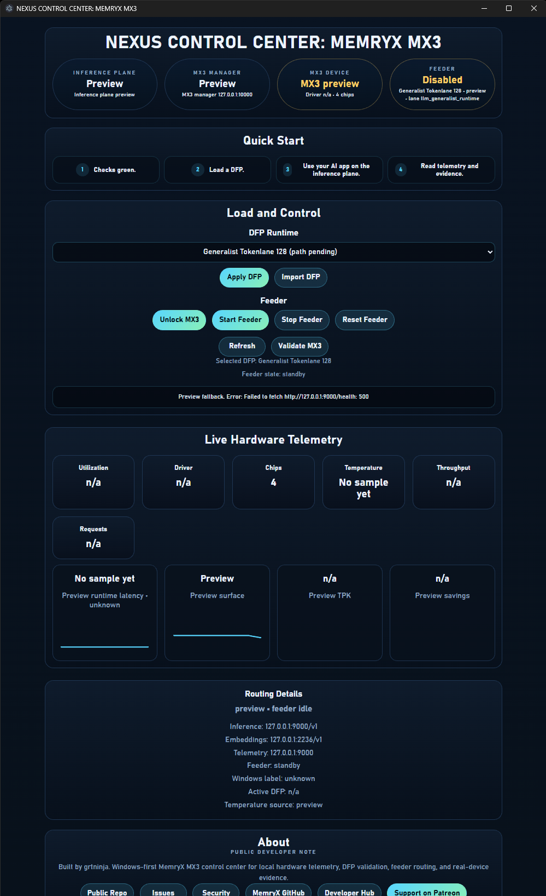

# NEXUS CONTROL CENTER: MemryX MX3

`NEXUS CONTROL CENTER` is a public Windows-first application for controlling, observing, and validating MemryX MX3 device workflows.



Use it to validate the MX3 device path, load DFP runtimes, control feeder state, and inspect current hardware telemetry and evidence.

## Hardware requirement

The physical-hardware workflow uses a supported MemryX AI Accelerator. Development and interface tests use explicitly labeled fixtures with synthetic provenance. Real-device acceptance uses current physical-device, DFP, feeder, execution, and telemetry evidence.

## Product capabilities

1. Checks MX3 device and manager readiness.
2. Inventories, loads, and switches admitted DFP runtime targets.
3. Controls feeder start, stop, unlock, reset, and recovery through owned lifecycle paths.
4. Shows current device identity, telemetry, latency, throughput, thermals, TPK, and savings evidence.
5. Presents a public desktop control and telemetry workflow over the repository-owned backend.
6. Supports local embedding and reranking examples for memory and retrieval applications.
7. Keeps language-model loading and residency with direct LM Studio at `http://127.0.0.1:1234/v1`.

## Runtime roles

- `http://127.0.0.1:1234/v1` — direct LM Studio model endpoint.
- `http://127.0.0.1:9000` — MX3 support-only service for device, DFP, feeder, telemetry, and accelerator state.
- `http://127.0.0.1:10000` — MX3 manager and hardware-support boundary.

LM model loading belongs to LM Studio, not this app. The MX3 service supplies support and hardware state; it is not the model host. The desktop application owns the visible Control Center workflow.

## MemPalace integration

Nexus Control Center can support MemPalace-style local retrieval at the accelerator seams while preserving the memory application's own structure and workflow:

1. local embeddings for Chroma ingest and query;
2. optional local reranking after retrieval;
3. current hardware identity, latency, TPK, and savings evidence;
4. explicit provenance for each accelerated route.

## TPK

`TPK` means `tokens per kilowatt-hour`. It expresses how much useful token output a measured workflow produced for its energy use.

A current TPK value requires admitted execution and energy evidence. The UI keeps TPK visibly unavailable or in a clearly labeled preview state until the required evidence exists.

## Quick start

### Human workflow

1. Confirm checks and device identity.
2. Select and load an admitted DFP.
3. Use the configured model or application route.
4. Review feeder state, telemetry, execution evidence, and output.

More detail:

- `docs/HUMAN_QUICKSTART.md`
- `docs/UI_VALUE_NOTES.md`

### AI-agent workflow

Use the public agent contract and boundaries:

- `docs/AGENT_QUICKSTART.md`
- `docs/PUBLIC_BOUNDARIES.md`
- `docs/PUBLIC_FILE_MAP.md`

## Python quick start

```bash
pip install -e ".[dev]"
python -m mx3_public_shim.doctor
python -m mx3_public_shim.server
```

## Desktop quick start

```bash
npm install
npm run desktop:start
```

## LM Studio integration

The published generator plugin `memryx-shim-provider` can connect LM Studio workflows to admitted MX3 compatibility capabilities.

Install page: `https://www.lmstudio.ai/grtninja/memryx-shim-provider`

The plugin remains an adapter. LM Studio retains ownership of its loaded language models at `http://127.0.0.1:1234/v1`; the MX3 backend retains ownership of device, DFP, feeder, telemetry, and accelerator support state.

## Official links

- Public repository: `https://github.com/grtninja/mx3-public-shim`
- MemryX GitHub: `https://github.com/memryx`
- MemryX Developer Hub: `https://developer.memryx.com/`
- MemryX site: `https://memryx.com/`
- MemPalace correlation: `docs/MEMPALACE_CORRELATION.md`
- MemPalace example: `contrib/mempalace/examples/mx3_shim_chroma_accel.md`

## Support development

- Patreon: `https://www.patreon.com/cw/grtninja`
- Posts: `https://www.patreon.com/grtninja/posts`

## Validation

```bash
python tools/check_public_repo_hygiene.py
pytest -q
ruff check .
ruff format --check .
npm test --if-present
npm run build --if-present
```

Hardware-dependent releases also include current real-device, DFP, feeder, telemetry, process-lifecycle, and visible desktop acceptance.
