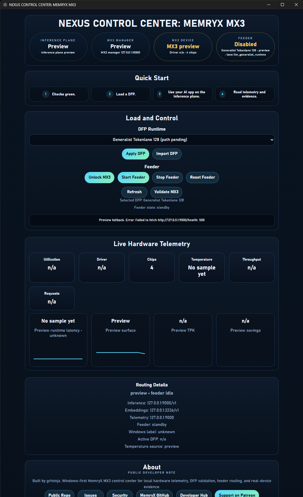

# MX3 Public Shim

`mx3-public-shim` is a public, standalone MemryX MX3 companion: a small Python
backend plus a bundled status UI. It gives you local embeddings and chat
routing over a provider chain — direct MX3 runtime on Linux, your own
LM Studio, or a deterministic CPU reference — with a visible status page for
the provider chain and device state.



## Hardware requirement

The physical-hardware path uses a supported MemryX AI Accelerator on Linux
with the official MemryX Python runtime and a compiled embedding DFP.
Development and interface tests use the explicitly labeled CPU reference with
synthetic provenance. Real-device acceptance uses current physical-device
evidence.

## Product capabilities

1. Reports MX3 device-runtime visibility (MemryX Python runtime + DFP path).
2. Serves local embeddings over `POST /v1/embeddings` via the provider chain.
3. Routes chat over `POST /v1/chat/completions` to your configured
   OpenAI-compatible endpoint (LM Studio at `http://127.0.0.1:1234/v1` by
   default). The shim never serves chat itself.
4. Shows the live provider chain, device state, and configuration in the
   bundled status UI.
5. Supports local embedding and reranking examples for memory and retrieval
   applications.
6. LM model loading belongs to LM Studio, not this app.

## Runtime roles

- `http://127.0.0.1:9015` — this repo's backend: status UI plus
  `/healthz`, `/api/provider-status`, `/v1/models`, `/v1/embeddings`,
  `/v1/chat/completions`.
- `http://127.0.0.1:1234/v1` — direct LM Studio model endpoint (your model
  host; chat and OpenAI-compatible embeddings route here by default).

The MX3 support-only service (`http://127.0.0.1:9000`) and the MX3 manager
boundary (`http://127.0.0.1:10000`) are private-workstation services. They
are not part of this repository and this app does not call them.

## MemPalace integration

MX3 Public Shim can support MemPalace-style local retrieval at the accelerator seams while preserving the memory application's own structure and workflow:

1. local embeddings for Chroma ingest and query;
2. optional local reranking after retrieval;
3. current provider-chain and device visibility from `/api/provider-status`;
4. explicit provenance for each accelerated route.

## TPK

`TPK` means `tokens per kilowatt-hour`. It expresses how much useful token output a measured workflow produced for its energy use.

A current TPK value requires admitted execution and energy evidence. This status UI does not display TPK; treat the term as a concept definition for evidence discussions, not a UI element.

## Quick start

### Human workflow

1. Start the backend: `python -m mx3_public_shim.server`.
2. Open `http://127.0.0.1:9015` and confirm the checks are green.
3. Call `POST /v1/embeddings` for local embeddings.
4. Use LM Studio directly at `http://127.0.0.1:1234/v1` for model loading
   and inference; `POST /v1/chat/completions` on this backend forwards
   there by default.
5. With MX3 hardware on Linux, set `MX3_PUBLIC_SHIM_EMBED_DFP` to your
   compiled embedding DFP and install the official MemryX Python runtime.

More detail:

- `docs/HUMAN_QUICKSTART.md`
- `docs/UI_VALUE_NOTES.md`

### AI-agent workflow

Use the public agent contract and boundaries:

- `docs/AGENT_QUICKSTART.md`
- `docs/PUBLIC_BOUNDARIES.md`
- `docs/PUBLIC_FILE_MAP.md`

## Python quick start

```bash
pip install -e ".[dev]"
python -m mx3_public_shim.doctor
python -m mx3_public_shim.server
```

## Desktop quick start

```bash
npm install
npm run desktop:start
```

## LM Studio integration

The published generator plugin `memryx-shim-provider` can connect LM Studio workflows to admitted MX3 compatibility capabilities.

Install page: `https://www.lmstudio.ai/grtninja/memryx-shim-provider`

The plugin remains an adapter. LM Studio retains ownership of its loaded language models at `http://127.0.0.1:1234/v1`; this repo's backend at `http://127.0.0.1:9015` owns the embeddings route, chat forwarding, provider-chain order, and the status UI. The private-workstation MX3 support service (`:9000`) and manager boundary (`:10000`) are not part of this repository.

## Official links

- Public repository: `https://github.com/grtninja/mx3-public-shim`
- MemryX GitHub: `https://github.com/memryx`
- MemryX Developer Hub: `https://developer.memryx.com/`
- MemryX site: `https://memryx.com/`
- MemPalace correlation: `docs/MEMPALACE_CORRELATION.md`
- MemPalace example: `contrib/mempalace/examples/mx3_shim_chroma_accel.md`

## Support development

- Patreon: `https://www.patreon.com/cw/grtninja`
- Posts: `https://www.patreon.com/grtninja/posts`

## Validation

```bash
python tools/check_public_repo_hygiene.py
pytest -q
ruff check .
ruff format --check .
npm test --if-present
npm run build --if-present
```

Hardware-dependent releases also include current real-device, DFP, feeder, telemetry, process-lifecycle, and visible desktop acceptance.
